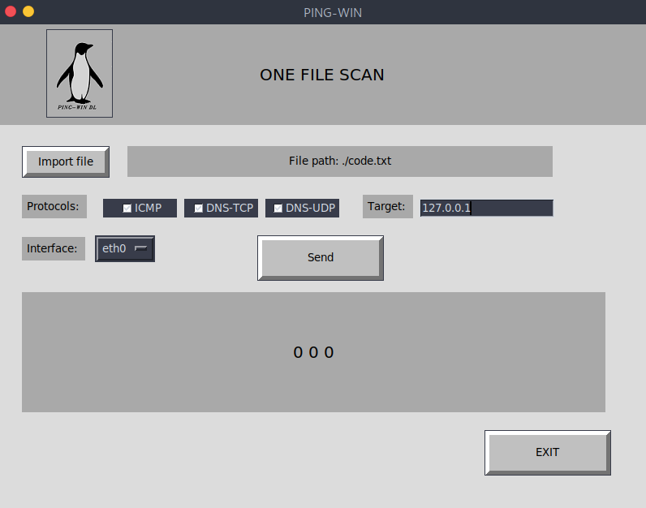
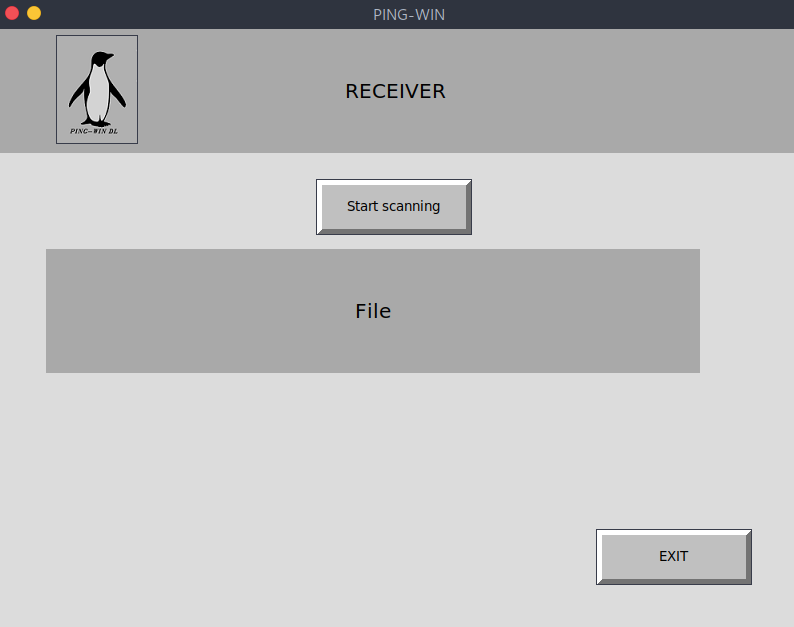
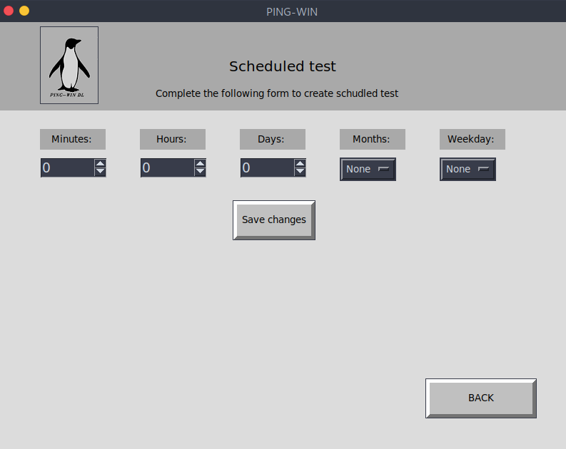

# PING - WIN 


---
Python educational and experimental based desktop application that uses stegnography to leak files through protocols which wasn't made for file transfer. 
This program will help someone check whether files can be transfered from his own computer to outside the internal network, using these protocols. 

* This project must not be used for illegal purposes. It is strictly for educational and experiments purposes. 

## Motivation for the project
The idea behind the project is to experiment and to strengthen my knowledge in PYTHON, in Networking, and to get deeper understanding about protocols. How protocols are built, what are their strengths and weaknesses, and how can someone get advantage knowing those weaknesses, and using them as a tool to leak secured files outside. 
This is a very basic implementation of the idea. I believe that it will get better in time.   

## How do I use this?

### 1. Through CLI
Run each command in a diffrent console:

**Step One:**
```bash
$ cd PingWin/CORE/

$ sudo python3 pingwinServer.py 
```
**Step Two:**
```bash
$ cd PingWin/CORE/

$ sudo python3 pingwinClient.py 
```
**Scheduled task:**
```bash
$ cd PingWin/CORE/
```
Example of using Scheduled task: call file with time as argument
```bash
$ pingwinCron.sh * * * * * 
```
### 2. Through GUI

> Run each command in a diffrent console:

**Step One:**
```bash
$ cd PingWin/UI/
```
```bash
$ sudo python3 ReceiverUI.py 
```
* Click on 'start scanning' 

**Step Two:**
```bash
$ cd PingWin/UI/

$ sudo python3 SenderUI.py 
```
**Scheduled task:**
```bash
$ cd PingWin/UI/

$ sudo python3 CronUI.py 
```
## Options
##### For full instructions: sudo python3 pingwinServer.py -h
### Sender:
* Import any file to the program
* Select which protocols the file will be sent through
    for now 3 options are available: ICMP, DNS-TCP, DNS
* Target - insert IP of target machine
* Interface - choose specific interface from the list
* Send - send file to target IP through chosen protocols.

### Receiver:
* Activate listener by pressing 'start scanning'
* When all files are sent - file for each protocol is created from the data on the packets.  Buttons to open files will show on the screen. 

## Example in pictures:




## Thanks:
My mentor was [Eden Berger](https://github.com/edenberger)
, who helped a lot to bring my project to life. 


# TODO list:

`First make it work, then make it right, then make it fast`

* Show data while running (send and receive)
* Add Encryption. 
* Send data in a way that will not be discovered (diffrent sizes, bytes, etc..)
* Add more protocols to the project
